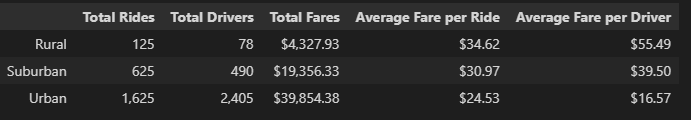
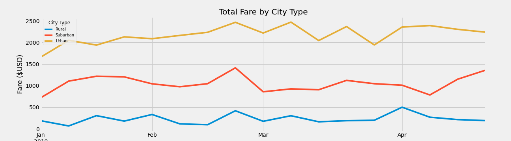

# PyBer_Analysis

## Overview of the Analysis:

V. Isualize assigned a new assignment to summarize the ride-sharing data by city type. Then, using Pandas and Matplotlib, create a multiple-line graph that shows the total weekly fares for each city type. 

## Resources:

- Data source: students_complete.csv
- software: Python 3.7.9, VS Code 1.65.2, conda 4.12.0, matplotlib 3.4.3

## Results:

### Summary Dataframe by City Type:

The summary figure shown above breaks down the key facts about the ride-sharing service in different city types. At a glance, we can see that the 'Urban' city types has the highest volume in Total Rides, Total Fares and Total drivers. In contrast, 'Rural' city types has the least amount in the same categories compared to other city types. 

In our analysis of the 'Average Fare per ride' and 'Average Fare per Driver', we see that 'Rural' city types is more lucrative for the driver and more expensive for the passenger relative to other city types. To be precise, a Pyber Driver in the Rural city on average makes 334% more than the driver in Urban cities and 140% more than drivers in Suburban cities. As for the average fare per ride, we see that Rural passenger average fare is at $34.62 where as Suburban and Urban is at $30.97 and 24.53, respectively. 

### Total Fare per Week by City Type:

The figure shown above illustrates the weekly sum of fare per city type. As observed in our previous chart, Urban Cities has the highest total fare in comparison to other cities followed by Suburban and then Rural. This outcome can be linked to the different population for each city type. Generally, Urban cities have more population in comparison to other city types.

## Summary:
In order to reduce the disparity between Urban, Suburban and Rural cities, the following are the recommendations:
    1. Lengthen the study to gain insight on seasonal treends.

    2. Increase the number of drivers in Rural areas to ensure that there are enough drivers to meet the demand resulting in cheaper fares.
    
    3. Change the rates based on city type. The fare cost in Rural areas might be off-putting for passengers.

